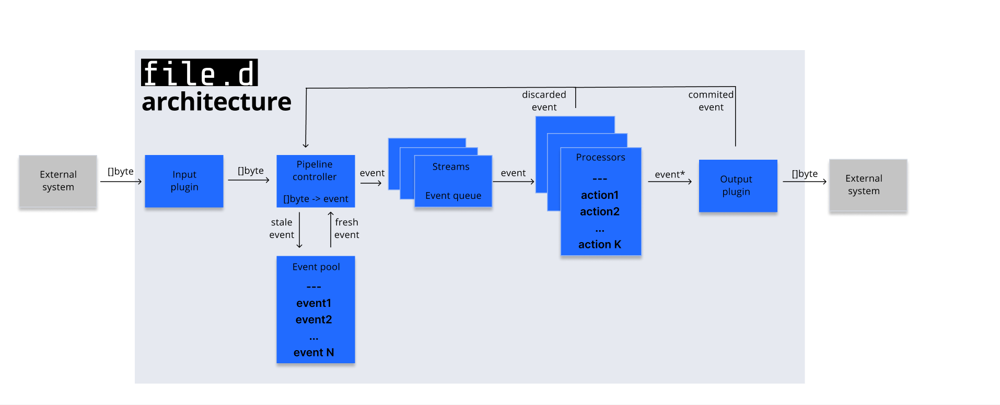

# Architecture 

Here is a bit simplified architecture of the **file.d** solution. 

What's going on here:

- Input plugins pull event logs from external systems and generate events from these data sources. At the moment, we have input plugins that read from a file, from the kafka server and gather data from the REST endpoint, but there is more to come. 
- The pipeline controller is in charge of an event routing.
- The event pool provides fast data accesses between threads. 
- Events are processed by one or more action plugins; they act on the events which meet particular criteria.
- Finally, the event goes to the output plugins and finishes its execution in external systems.  

You can configure your pipeline your way by writing input, action, and output plugins. 
